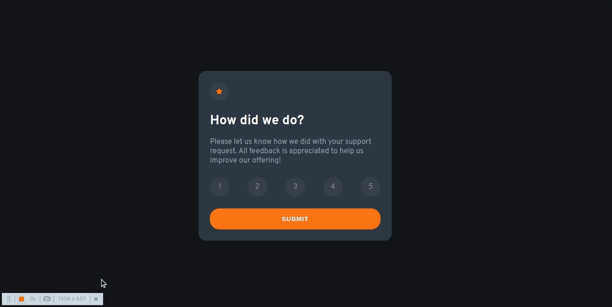
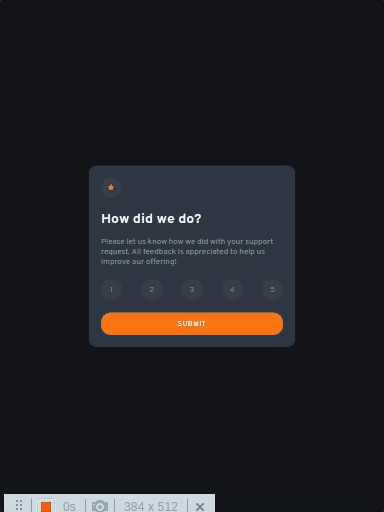
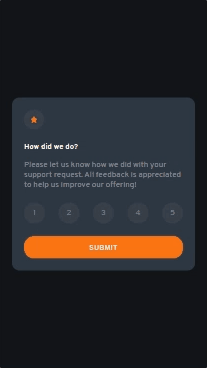

# Interactive rating component

#### Interactive rating component é um desafio do Frontend Mentor feito com HTML,CSS e Javascript. Esse projeto, apresar de parecer bem simples, traz elementos muito interessantes nessas linguagens. Nesse projeto dou ênfase a lógica usando javascript puro. Obrigado por chegar até aqui. Confira o código.

## Índice

- [Captura de tela](#captura-de-tela)
- [Links](#links)
- [Construído com](#construído-com)
- [O que aprendi](#o-que-aprendi)
- [Desenvolvimento contínuo](#desenvolvimento-contínuo)
- [Recursos úteis](#recursos-úteis)
- [Fernando Mendes](#autor)

### Captura de tela

#### Tela Desktop



#### Tela Ipad



#### Tela Mobile



### Links

- Site URL: https://nandosti.github.io/landing-page-huddle/

### Construído com

<div style="display: inline_block"><br>
  
   
        
</div>

### O que aprendi

Nesse projeto envolvendo HTML,CSS e Javascript, aprendi conceitos importantes. Através do CSS, aprendi a dar estilo e formatar elementos HTML, explorando propriedades como cores, fontes, posicionamento,animações, responsividade, pseudo classes e pseudo elemento. Aprendi várias maneiras de selecionar elementos no DOM. Usando métodos como getElementById, getElementsByClassName, getElementsByTagName e querySelector, pude obter referências para os elementos da página com facilidade, permitindo que eu manipulasse suas propriedades e conteúdos. No processo de aprendizado, foi importante entender os conceitos fundamentais de cada linguagem. Praticar esses conceitos em projetos reais nos ajuda a aprimorar nossas habilidades e explorar diferentes técnicas e soluções para os desafios que encontramos.

## Trechos de códigos

```

const cardRatingNumberDom = document.querySelectorAll('.card__rating-number');
const firstCard = document.querySelector('.first--card');
const secondCard = document.querySelector('.second--card');
const resultValue = document.querySelector('.card__result-value')

let activeRatingNumber;

function selectNumber(number){
    const selectedratingNumberDom = cardRatingNumberDom[number - 1];
    selectedratingNumberDom.classList.add('active');

    if(activeRatingNumber) {
        const activeRatingDom = cardRatingNumberDom[activeRatingNumber - 1]
        activeRatingDom.classList.remove('active');
    }

    activeRatingNumber = number
}

function submit(){

    if(!activeRatingNumber) return;

    firstCard.classList.add('hide');
    secondCard.classList.remove('hide');

    resultValue.textContent = activeRatingNumber;
}


```

### Desenvolvimento contínuo

Pretendo continuar focado em construir um conhecimento sólido nessas limguagens. Ainda há muitos conceitos importantes para serem desenvolvidos. Todos os dias são gradativamente adicionados ao meu repertório de ferramentas.

### Recursos úteis

- [W3School](https://www.w3schools.com/css/default.asp) - Esse site sempre me ajuda a resolver qualquer problema relacionados a códigos de uma maneira fácil e muito rápida.
- [Dev em Dobro](https://www.youtube.com/@DevemDobro) - Este é um canal onde encontro muito material. Tem muito conteúdo relacionado ao desenvolvimento. Recomendo a todos que querem aprender sobre esse e outros conceitos relacionados.

## Autor

[Fernando Mendes](https://www.linkedin.com/in/fernandomendesti/)
